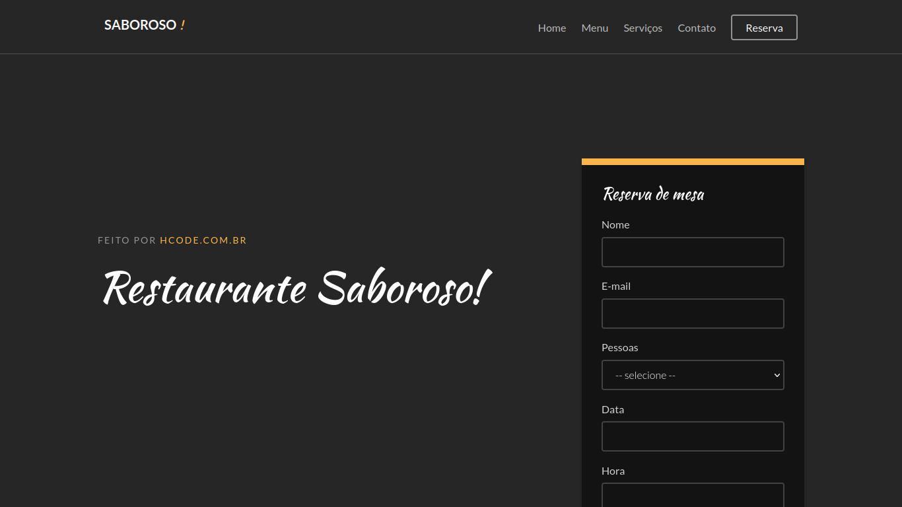

# Resturante Saboroso

</img>

Projeto desenvolvido como exemplo do Curso Completo de JavaScript na Udemy.com

### Lista de recursos usados em aula para este projeto
| Recurso | Link |
| ------ | ------ |
| socket.io | https://socket.io/ |
| mysql | https://www.mysql.com/ |
| Express | https://expressjs.com/pt-br/ |
| chart | https://www.chartjs.org/ |
| moment.js | https://momentjs.com/ |
| redis | https://redis.io